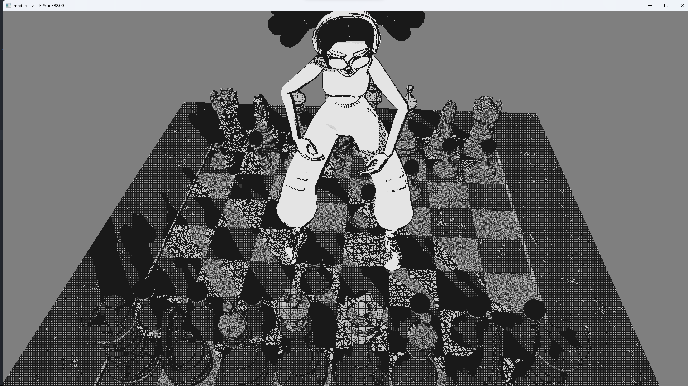
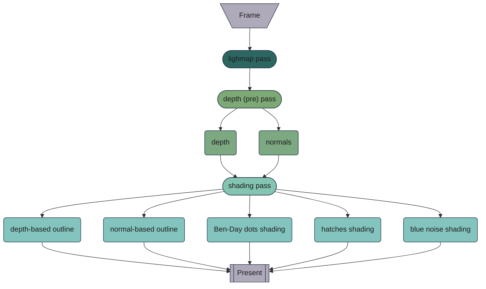

# Mangaka 
**Mangaka**  is a manga-style renderer. It is made with [Lum-al](https://github.com/platonvin/lum-al) and offers (limited) support for `.gltf` models. Currently not available in a form of library, but you can start your own Lum-al project from Mangaka

##### Screenshot

## Installation 
 
- ### Prerequisites 
 
  - **C++ Compiler** : [MSYS2 MinGW](https://www.msys2.org/)  recommended for Windows. For Linux, prefer GNU C++.
 
  - **Vcpkg** : follow instructions at [Vcpkg](https://vcpkg.io/en/getting-started) .
 
  - **Make** : for Windows, install with MinGW64. For Linux, typically installed by default.
 
  - **Vulkan SDK** : ensure that you have the [Vulkan SDK](https://vulkan.lunarg.com/) if you want Lum-al debug features (**on** by default)
 
- ### Steps 

  - Ensure you have a C++20 compiler, Vcpkg, and Make.
 
  - Clone the repository with all submodules:
    `$ git clone https://github.com/platonvin/mangaka.git --recurse-submodules` 
 
  - Navigate to the project directory:
`$ cd mangaka`
 
  - Install dependencies via Vcpkg:
`$ vcpkg install` 
    - On Linux, GLFW may ask you to install multiple packages. Install them in advance:
`sudo apt install libxinerama-dev libxcursor-dev xorg-dev libglu1-mesa-dev pkg-config build-essential`.
 
    - For MinGW on Windows specify MinGW as triplet:
`$ vcpkg install --triplet=x64-mingw-static --host-triplet=x64-mingw-static`.
 
  - Build and run the project:
`$ make -j10`

## Renderer Overview 

## Demo Controls 

- WASD for camera movement.

- Mouse for camera orientation.

- "Esc" to close the demo.